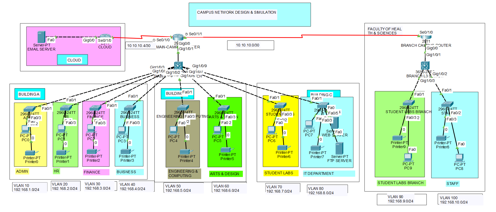

# Campus Enterprise Network Design & Simulation

---

#### Project Statement

Albion University is a large university with two campuses situated 20 miles apart. The university's students and staff are distributed across four faculties: Health and Sciences, Business, Engineering and Computing, and Arts and Design. Each member of staff has a PC and students have access to PCs in the labs.

The objective of this project was to plan, design, and prototype a complete enterprise network for Albion University using Cisco Packet Tracer, providing full end-to-end connectivity across both campuses and access to internal and external servers.



---

#### Network Topology Overview

The network is divided into two sites connected via serial WAN links, with a third serial link to an external cloud router hosting the university email server.

Main Campus contains three buildings:

- Building A houses the Administrative Staff, HR, Finance, and Business departments
- Building B houses the Engineering and Computing, and Arts and Design faculties
- Building C houses the Student Labs and IT Department, which hosts the university web server and FTP server

Branch Campus contains one faculty:

- Faculty of Health and Sciences, with staff and student labs on separate floors

A cloud router represents the external internet and hosts the university email server.

---

#### Features Implemented

**Hierarchical Network Design**

The network follows a three-tier hierarchical model throughout both campuses. A router sits at the core layer providing inter-site and external routing. A Layer 3 multilayer switch (Cisco 3650) sits at the distribution layer handling inter-VLAN routing. Layer 2 switches sit at the access layer, one per department, connecting end devices.

**VLAN Segmentation**

Each department is isolated on its own VLAN and subnet, ensuring traffic separation and security across the network.

| Department | VLAN | Network |
|---|---|---|
| Admin | 10 | 192.168.1.0/24 |
| HR | 20 | 192.168.2.0/24 |
| Finance | 30 | 192.168.3.0/24 |
| Business | 40 | 192.168.4.0/24 |
| Engineering and Computing | 50 | 192.168.5.0/24 |
| Arts and Design | 60 | 192.168.6.0/24 |
| Student Labs (Main) | 70 | 192.168.7.0/24 |
| IT Department | 80 | 192.168.8.0/24 |
| Staff (Branch) | 90 | 192.168.9.0/24 |
| Student Labs (Branch) | 100 | 192.168.10.0/24 |

**Inter-VLAN Routing**

Inter-VLAN routing is configured on the main campus router using router-on-a-stick with sub-interfaces, one per VLAN, on the GigabitEthernet interface connecting to the main campus Layer 3 switch. The same approach is used on the branch campus router for VLAN 90 and VLAN 100.

**DHCP Server**

A router-based DHCP server is configured on the main campus router. A separate pool is created for each of the eight main campus departments and the two branch campus departments, with each pool assigning the correct default gateway and DNS server to devices dynamically.

**Trunk and Access Port Configuration**

All access layer switches have their ports configured in access mode and assigned to the correct VLAN. The uplink ports on the Layer 3 switches connecting toward the routers are configured as trunk ports using 802.1Q encapsulation, allowing all VLANs to traverse the uplink.

**WAN Serial Links**

Serial connections using HDLC encapsulation connect the three routers. The HWIC-2T module was added to each router to provide serial interfaces. Clock rate is set on the DCE side of each serial link.

| Link | Network | Main Router Interface | Remote Interface |
|---|---|---|---|
| Main to Branch | 10.10.10.0/30 | Serial0/1/1 | Serial0/1/0 |
| Main to Cloud | 10.10.10.4/30 | Serial0/1/0 | Serial0/1/0 |

**RIP Version 2 Routing**

RIPv2 is configured on the main campus router and branch campus router to dynamically exchange routes between the two campuses. Auto-summary is disabled on both routers to prevent route summarisation issues across the discontiguous subnets. The cloud router also participates in RIP to advertise the email server network back to the campus routers.

**Static Routing for External Server**

A specific static route is configured on the main campus router to reach the external email server network via the cloud router:

```
ip route 20.0.0.0 255.255.255.252 Serial0/1/0
```

The cloud router uses a default route pointing back toward the main campus router to forward reply traffic to any campus subnet.

**Servers**

- Web Server: hosted in the IT Department, Building C, Main Campus
- FTP Server: hosted in the IT Department, Building C, Main Campus
- Email Server: hosted externally on the cloud router network at 20.0.0.2/30

**End Devices**

Each department has at least one PC and one printer. The IT Department additionally hosts the web server and FTP server. All end devices obtain their IP addresses dynamically via DHCP.

---

#### Tools Used

- Cisco Packet Tracer
- Cisco 2911 Router
- Cisco 3650 Multilayer Switch
- Cisco 2960 Layer 2 Switch
- HWIC-2T Serial Module

---

#### How to Open

1. Download the `.pkt` file from this repository
2. Open Cisco Packet Tracer
3. Load the file via File > Open
4. Wait approximately 30 seconds in Realtime mode for RIP to converge before testing connectivity
5. Use the Add Simple PDU tool or the PC command prompt to verify end-to-end connectivity between campuses and to the email server
